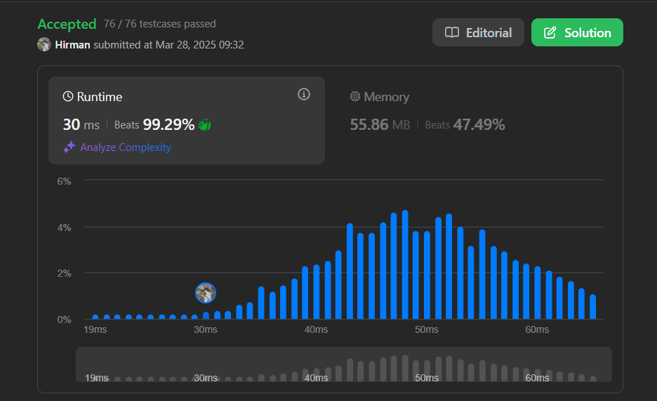

# overview 
I want to solve all the questions in the [30 Days of JavaScript](https://leetcode.com/studyplan/30-days-of-javascript/) section on the Leetcode site in the shortest possible time so that I can become proficient in js very quickly. The image of my best results is posted here.

### 2634

### 2623

### 2677

### 2625

